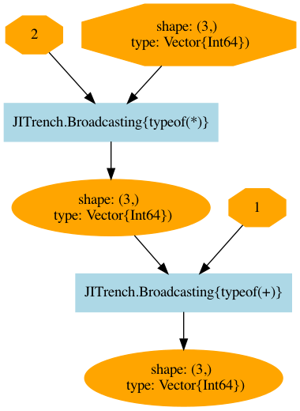
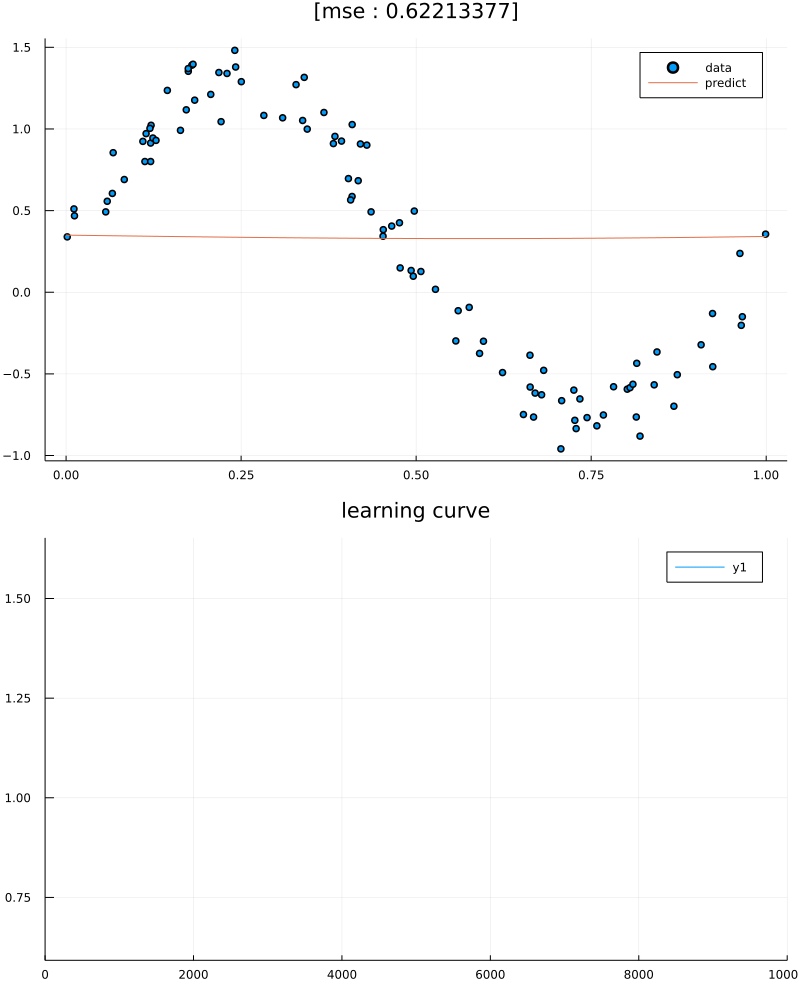

# JITrench


<h1 align="center">
  <br/>
</h1>
<p align="center">lightweight, <br>scalable, <br>and affordable deep learning framework.<br>Let's dive into the deep trenches of the loss function <br>with JITrench.jl.</b></p>

[](https://abap34.github.io/JITrench.jl/stable)
[](https://abap34.github.io/JITrench.jl/dev)
[](https://travis-ci.com/abap34/JITrench.jl)


---

## Install
```
]add https://github.com/abap34/JITrench.jl
```

## Auto Grad
```julia                                                 
julia> using JITrench

julia> f(x) = 2x^2 + 4x + 3
f (generic function with 1 method)

julia> @diff! f(x) # f′(x) = 4x + 4
f′ (generic function with 1 method)

julia> f′(2)
12

julia> f′(3)
16
```


## AutoGrad in "Deep" Function

```julia
julia> x = Variable(2.5, name="x")
name: x 
values: 2.5
creator: User-Defined(nothing)

julia> y = Variable(3.5, name="y")
name: y 
values: 3.5
creator: User-Defined(nothing)

julia> goldstain(x, y) = (1 + (x + y + 1)^2 * (19 - 14x + 3x^2 - 14y + 6x*y + 3y^2)) *  (30 + (2x - 3y)^2 * (18 - 32x + 12x^2 + 48y - 36x*y + 27*y^2))
goldstain (generic function with 1 method)

julia> z = goldstain(x, y)
name: nothing 
values: 1.260939725e7
creator: JITrench.Mul

julia> JITrench.plot_graph(z, to_file="graph.png")
```


## AutoGrad with broadcast, user defined function

```julia
julia> x = Variable([1, 2, 3])
name: nothing 
values: [1, 2, 3]
creator: User-Defined(nothing)

julia> f(x) = 2x + 1
f (generic function with 1 method)

julia> y = f.(x)
name: nothing 
values: [3, 5, 7]
creator: JITrench.Broadcasting{typeof(+)}

julia> backward!(y)

julia> x
name: nothing 
values: [1, 2, 3]
grad: Variable([2, 2, 2])
creator: User-Defined(nothing)
```



## Example: Train Neural Networks

```julia
using JITrench: Variable, Model, Linear, sigmoid, SGD,  mean_squared_error, cleargrads!, backward!, optimize!
using Printf
using Random

Random.seed!(10)

function generate_dataset(N)
    x = rand(N, 1) 
    y = sin.(2π .* x) .+ (rand(N, 1) .* 0.5)
    return Variable(x),  Variable(y)
end

function train(model, x, y; n_iters=10000, lr=1e-1)
    optimizer = SGD(layers, lr=1e-1)
    JITrench.plot_model(model, x)
    for iter in 1:n_iters
        y_pred = model(x)
        loss = mean_squared_error(y, y_pred)
        cleargrads!(model, layers, skip_uninit=true)
        backward!(loss)
        optimize!(model, optimizer)
    end 
end    

mutable struct MLP <: Model
    l1 :: Linear
    l2 :: Linear
    MLP(hidden_dim, out_dim) = new(Linear(hidden_dim), Linear(out_dim))
end

layers(model::MLP) = (model.l1, model.l2)

(model::MLP)(x) = x |> model.l1 .|> sigmoid |> model.l2

model = MLP(10, 1)

train(model, generate_dataset(100)...)
```


