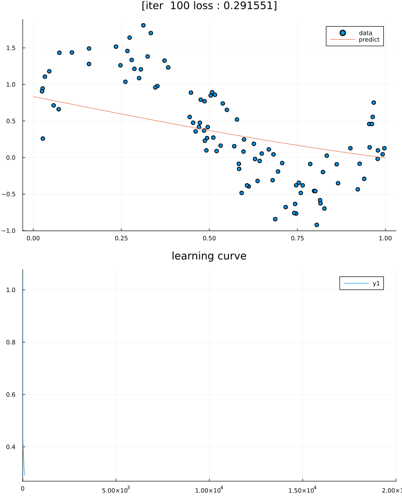

# JITrench


<h1 align="center">
  <br/>
</h1>
<p align="center">Let's dive into the deep trenches of the loss function <br>with JITrench.jl.</b></p>

[](https://abap34.github.io/JITrench.jl/stable)
[](https://abap34.github.io/JITrench.jl/dev)
[](https://travis-ci.com/abap34/JITrench.jl)


---

## Install
```
]add https://github.com/abap34/JITrench.jl
```

## Automatic gradient calculation


```julia                                                 
julia> using JITrench

julia> f(x) = sin(x) + 1
f (generic function with 1 method)

julia> JITrench.@diff! f(x)
f′ (generic function with 1 method)

julia> f′(π)
-1.0
```


## Compute gradients for "Deep" functions, visualize computational graphs

```julia
julia> x = Scalar(2.5)
Scalar{Float64}(2.5) 


julia> y = Scalar(3.5)
Scalar{Float64}(3.5) 

julia> goldstain(x, y) = (1 + (x + y + 1)^2 * (19 - 14x + 3x^2 - 14y + 6x*y + 3y^2)) *  (30 + (2x - 3y)^2 * (18 - 32x + 12x^2 + 48y - 36x*y + 27*y^2))
goldstain (generic function with 1 method)

julia> z = goldstain(x, y)
Scalar{Float64}(1.260939725e7) 

julia> backward!(z)

julia> x.grad
-5.324409e6

julia> y.grad
3.3109701e7

julia> JITrench.plot_graph(z, to_file="example/visualize/goldstain.png")
```


## Compute gradients for operations on multidimensional arrays


```julia
julia> A = AutoDiff.Tensor([1 2; 3 4; 5 6])
3×2 Tensor{Matrix{Int64}}: 
 1  2
 3  4
 5  6 
 

julia> B = reshape(A, (2, 3))
2×3 Tensor{Matrix{Int64}}: 
 1  5  4
 3  2  6 
 

julia> C = B[1, :]
3×1 Tensor{Vector{Int64}}: 
 1
 5
 4 
 

julia> y = sum(C)
Scalar{Int64}(10) 


julia> backward!(y)

julia> A.grad
3×2 Matrix{Float64}:
 1.0  0.0
 0.0  1.0
 1.0  0.0
```

# GPU Support: CuTensor

With the `CuTensor` type, you can perform calculations on the GPU as you would with `Tensor`.

```julia
julia> using JITrench

julia> using BenchmarkTools

julia> x = Tensor(rand(512, 512));

julia> W = Tensor(rand(512, 512));

julia> x_gpu = CuTensor(rand(512, 512));

julia> W_gpu = CuTensor(rand(512, 512));

julia> @benchmark x * W
BenchmarkTools.Trial: 7490 samples with 1 evaluation.
 Range (min … max):  616.548 μs …  1.238 ms  ┊ GC (min … max): 0.00% … 47.29%
 Time  (median):     649.301 μs              ┊ GC (median):    0.00%
 Time  (mean ± σ):   665.530 μs ± 90.051 μs  ┊ GC (mean ± σ):  2.36% ±  7.64%

    ▆█▆▂                                                  ▁    ▁
  ▄▇████▇▆▃▃▁▁▁▄▃▁▁▁▁▃▁▁▃▁▁▁▁▁▁▁▁▁▁▁▁▁▁▁▁▁▁▁▁▁▁▁▁▁▁▁▁▁▁▁▁▆██▇▇ █
  617 μs        Histogram: log(frequency) by time      1.19 ms <

 Memory estimate: 2.00 MiB, allocs estimate: 5.

julia> @benchmark x_gpu * W_gpu
BenchmarkTools.Trial: 10000 samples with 3 evaluations.
 Range (min … max):   8.317 μs …  12.454 ms  ┊ GC (min … max): 0.00% … 10.13%
 Time  (median):     38.716 μs               ┊ GC (median):    0.00%
 Time  (mean ± σ):   38.481 μs ± 124.332 μs  ┊ GC (mean ± σ):  0.33% ±  0.10%

  ▄                                            ▃▁▂    ▁  ▄█▆▃▄ ▂
  █▅▄▅▁▁▃▁▁▁▁▃▁▁▁▁▁▁▁▁▁▁▁▁▁▁▁▃▁▁▁▁▁▁▁▁▁▁▁▁▁▁▁▁▄███▅▄▁▄█▇▆█████ █
  8.32 μs       Histogram: log(frequency) by time      40.6 μs <

 Memory estimate: 704 bytes, allocs estimate: 31.
```


# Example: Gradient Descent

```julia
rosenbrock(x₀, x₁) = 100 * (x₁ - x₀^2)^2 + (x₀ - 1)^2

x₀ = Scalar(0.0)
x₁ = Scalar(5.0)
lr = 1e-3
iters = 10000

for i in 1:iters    
    y = rosenbrock(x₀, x₁)
    JITrench.AutoDiff.cleargrad!(x₀)
    JITrench.AutoDiff.cleargrad!(x₁)
    backward!(y)
    x₀.values -= lr * x₀.grad
    x₁.values -= lr * x₁.grad
end
```


See example/optimization/gradient_descent.jl for details.

# Example: Newton Method

JITrench.jl can also compute higher-order derivatives!

```julia
using JITrench

f(x) = x^4 - 2x^2

x = Scalar(2.0)
iters = 10

for i in 1:iters    
    y = f(x)
    JITrench.AutoDiff.cleargrad!(x)
    backward!(y, create_graph=true)
    gx = x.grad
    JITrench.AutoDiff.cleargrad!(gx)
    backward!(gx)
    gx2 = x.grad
    x.values -= gx.values / gx2.values
end
```

See example/optimization/newton_method.jl for details.

# Example: Train Neural Network

```julia
using JITrench
using JITrench.NN 
using Printf


N = 100
p = 1
n_iter = 20000

x = rand(N, p)
y = sin.(2π .* x) + (rand(N, p) / 1)

function model(x)
    x = NN.Linear(out_dim=10)(x)
    x = NN.functions.sigmoid.(x)
    x = NN.Linear(out_dim=1)(x)
    return NN.result(x)
end

params = NN.init(model, NN.Initializer((nothing, 1)))
optimizer = NN.SGD(params, 1e-1)

x = Tensor(x)
y = Tensor(y)

for iter in 1:n_iter
    pred = NN.apply(model, x, params)
    loss = NN.functions.mean_squared_error(y, pred)
    NN.cleargrads!(params)
    backward!(loss)
    NN.optimize!(optimizer)
    if (iter % 500 == 0)
        @printf "[iters] %4i [loss] %.4f\n" iter loss.values 
    end
end


NN.save_weight(params, "weight")
```

This is a simple example of training a sine curve on an MLP and saving the weights as 'weights.jtw'

Progress of the training:



The visualization code is available in 'example/NN/MLP.jl'.
