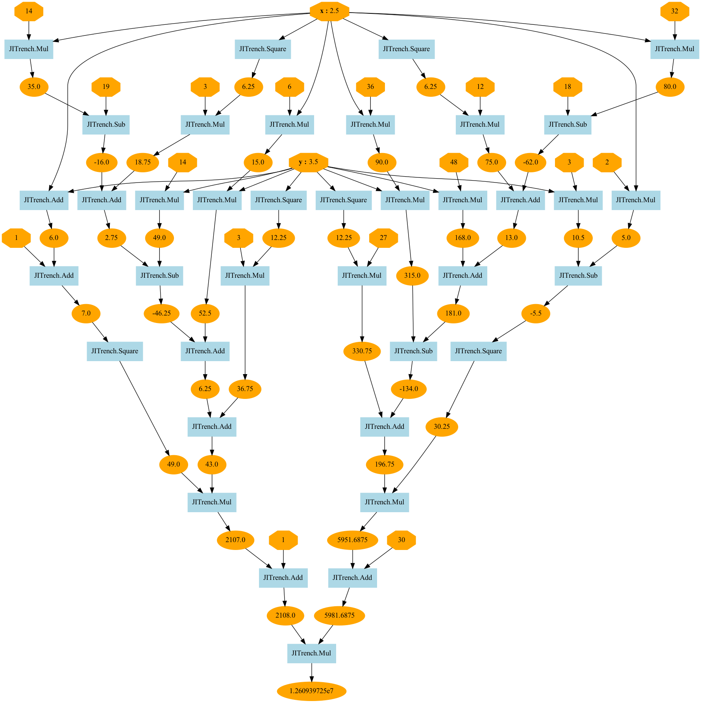
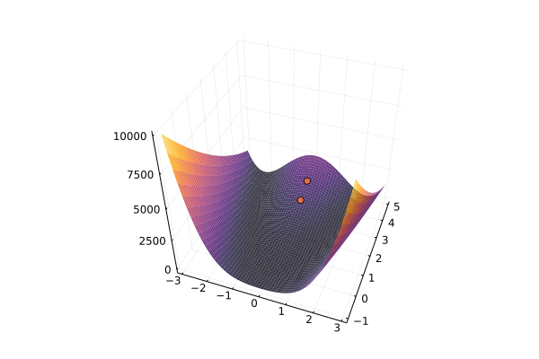

# JITrench


<h1 align="center">
  <br/>
</h1>
<p align="center">lightweight, <br>scalable, <br>and affordable deep learning framework.<br>Let's dive into the deep trenches of the loss function <br>with JITrench.jl.</b></p>

[](https://abap34.github.io/JITrench.jl/stable)
[](https://abap34.github.io/JITrench.jl/dev)
[](https://travis-ci.com/abap34/JITrench.jl)


---

## Install
```
]add https://github.com/abap34/JITrench.jl
```

## Automatic gradient calculation


```julia                                                 
julia> using JITrench

julia> f(x) = sin(x) + 1
f (generic function with 1 method)

julia> JITrench.@diff! f(x)
f′ (generic function with 1 method)

julia> f′(π)
-1.0
```


## Compute gradients for "Deep" functions, visualize computational graphs

```julia
julia> x = Scalar(2.5)
Scalar{Float64}(2.5) 


julia> y = Scalar(3.5)
Scalar{Float64}(3.5) 

julia> goldstain(x, y) = (1 + (x + y + 1)^2 * (19 - 14x + 3x^2 - 14y + 6x*y + 3y^2)) *  (30 + (2x - 3y)^2 * (18 - 32x + 12x^2 + 48y - 36x*y + 27*y^2))
goldstain (generic function with 1 method)

julia> z = goldstain(x, y)
Scalar{Float64}(1.260939725e7) 

julia> backward!(z)

julia> x.grad
-5.324409e6

julia> y.grad
3.3109701e7

julia> JITrench.plot_graph(z, to_file="example/visualize/goldstain.png")
```



## Compute gradients for operations on multidimensional arrays


```julia
julia> A = AutoDiff.Tensor([1 2; 3 4; 5 6])
3×2 Tensor{Matrix{Int64}}: 
 1  2
 3  4
 5  6 
 

julia> B = reshape(A, (2, 3))
2×3 Tensor{Matrix{Int64}}: 
 1  5  4
 3  2  6 
 

julia> C = B[1, :]
3×1 Tensor{Vector{Int64}}: 
 1
 5
 4 
 

julia> y = sum(C)
Scalar{Int64}(10) 


julia> backward!(y)

julia> A.grad
3×2 Matrix{Float64}:
 1.0  0.0
 0.0  1.0
 1.0  0.0
```

# Example: Gradient Descent

```julia
rosenbrock(x₀, x₁) = 100 * (x₁ - x₀^2)^2 + (x₀ - 1)^2

x₀ = Scalar(0.0)
x₁ = Scalar(5.0)
lr = 1e-3
iters = 10000

x₀_history = Float64[]
x₁_history = Float64[]

for i in 1:iters    
    y = rosenbrock(x₀, x₁)

    JITrench.AutoDiff.cleargrad!(x₀)
    JITrench.AutoDiff.cleargrad!(x₁)
    backward!(y)
    
    x₀.values -= lr * x₀.grad
    x₁.values -= lr * x₁.grad
end
```



See example/optimization/gradient_descent.jl for details.

# Example: Newton Method

JITrench.jl can also compute higher-order derivatives!

```julia
using JITrench

f(x) = x^4 - 2x^2

x = Scalar(2.0)
iters = 10

for i in 1:iters    
    y = f(x)
    
    JITrench.AutoDiff.cleargrad!(x)
    backward!(y, create_graph=true)
    gx = x.grad

JITrench.AutoDiff.cleargrad!(gx)
    backward!(gx)
    gx2 = x.grad
    x.values -= gx.values / gx2.values

end
```

See example/optimization/newton_method.jl for details.